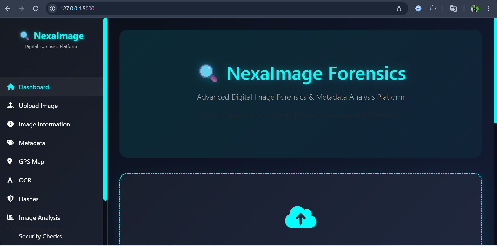
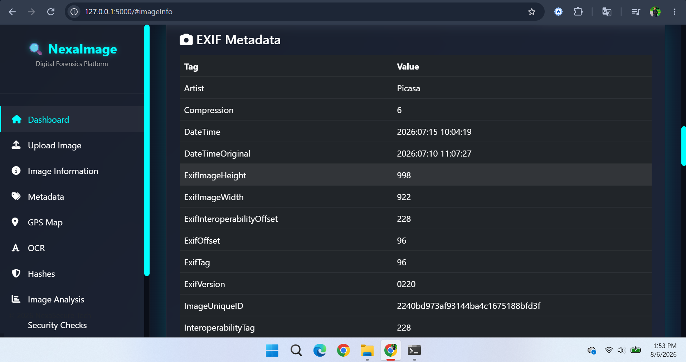
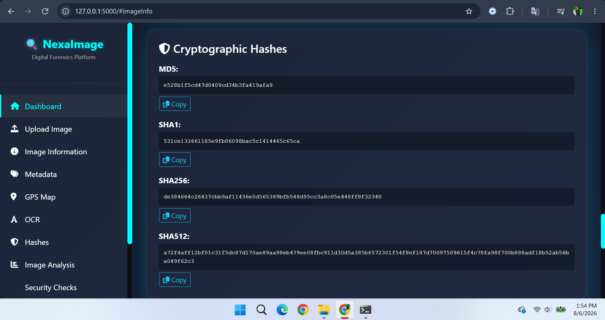

<div align="center">
  
</div>

<br>

<div align="center">
  
  # 🔍 NexaImage Forensics
  
  *Advanced Digital Image Forensics & Metadata Analysis Platform*
  
  [](https://github.com/nexasecure/nexaimage-forensics)
  [](https://www.python.org/)
  [](https://flask.palletsprojects.com/)
  [](LICENSE)
  
  <br>
  
  <p align="center">
    
  </p>
  
</div>

<br>

---

## 🌟 About NexaImage Forensics

**NexaImage Forensics** is a cutting-edge digital image forensics and metadata analysis platform developed by **NexaSecure Tech**. This powerful tool is designed for cybersecurity professionals, digital forensics investigators, law enforcement agencies, and security researchers who need to extract, analyze, and verify detailed information from digital images.

With its sleek dark-themed UI and glassmorphism design, NexaImage Forensics provides a professional environment for conducting thorough image investigations. The platform combines multiple forensic techniques into a single, easy-to-use interface.

---

## 🏢 About NexaSecure Tech

**NexaSecure Tech** is a leading provider of Digital Forensics and Cyber Security Solutions. We specialize in developing advanced tools and platforms that empower security professionals to investigate, analyze, and secure digital assets.

Founded with the mission to make digital forensics accessible and effective, NexaSecure Tech combines cutting-edge technology with user-centric design to deliver powerful security solutions.

### 🌐 Our Website
[](https://www.nexasectech.com)

### 📱 Connect With NexaSecure Tech

<p align="center">
  
  [](https://twitter.com/talhabaig007)
  [](https://www.linkedin.com/company/nexasecuretech)
  [](https://github.com/talhabaig007)
  [](https://instagram.com/NexaSecureTech)
  [](https://facebook.com/NexaSecureTech)
  [](https://youtube.com/@talhabaighacker)
  
</p>

### 📧 Contact Us
- **Email:** info@nexasectech.com
- **Support:** baigb4165@gmail.com

---

## ✨ Features

<table>
  <tr>
    <td width="50%">
      <h3>🔍 Forensic Analysis</h3>
      <ul>
        <li>Complete EXIF Metadata Extraction</li>
        <li>GPS Location Analysis with Interactive Maps</li>
        <li>Cryptographic Hash Generation (MD5, SHA1, SHA256, SHA512)</li>
        <li>Hash Verification System</li>
        <li>Image Quality Analysis</li>
        <li>Security Risk Assessment</li>
      </ul>
    </td>
    <td width="50%">
      <h3>🛠️ Advanced Tools</h3>
      <ul>
        <li>OCR Text Extraction (English & Urdu)</li>
        <li>Color Histogram Analysis</li>
        <li>Dominant Color Detection</li>
        <li>Noise & Sharpness Estimation</li>
        <li>Compression Detection</li>
        <li>File Entropy Calculation</li>
      </ul>
    </td>
  </tr>
  <tr>
    <td>
      <h3>📊 Reporting</h3>
      <ul>
        <li>Professional PDF Report Generation</li>
        <li>Detailed Analysis Reports</li>
        <li>GPS Map Screenshots</li>
        <li>Security Risk Indicators</li>
        <li>Exportable Data</li>
      </ul>
    </td>
    <td>
      <h3>🎨 User Interface</h3>
      <ul>
        <li>Dark Blue & Black Cyberpunk Theme</li>
        <li>Neon Cyan Accents</li>
        <li>Glassmorphism Design</li>
        <li>Responsive Layout</li>
        <li>Animated Cards & Effects</li>
        <li>Custom Scrollbars</li>
      </ul>
    </td>
  </tr>
</table>

---

## 🖼️ Screenshots

<div align="center">
  
  ### Dashboard
  
  
  <br>
  
  ### Analysis Results
  
  
  <br>
  
  ### Hashes View
  
  
</div>

---

## 🚀 Installation

### Prerequisites

- **Python 3.8 or higher**
- **pip (Python Package Manager)**
- **Tesseract OCR** (for text extraction)

### Step 1: Clone the Repository

```bash
git clone https://github.com/nexasecure/nexaimage-forensics.git
cd nexaimage-forensics
```


### Step 2: Install Python Dependencies

```bash
pip install -r requirements.txt
```
### Step 3: Install Tesseract OCR
- Windows
Download and install from: Tesseract OCR for Windows

### Linux (Ubuntu/Debian)
```bash
sudo apt-get update
sudo apt-get install tesseract-ocr
sudo apt-get install tesseract-ocr-eng
sudo apt-get install tesseract-ocr-urd
```
### macOS
```bash
brew install tesseract
brew install tesseract-lang
```
### Step 4: Run the Application
```bash
python app.py
```
### Step 5: Open in Browser
Navigate to: http://localhost:5000

## 📁 Project Structure

<pre>
<b>nexaimage-forensics/</b>
│
├── <b>app.py</b>                      # Main Flask Application
├── <b>config.py</b>                   # Configuration File
├── <b>requirements.txt</b>            # Python Dependencies
├── <b>README.md</b>                   # Project Documentation
├── <b>LICENSE</b>                     # MIT License
├── <b>img.png</b>                     # Project Banner Image
│
├── <b>utils/</b>                      # Utility Modules
│   ├── __init__.py
│   ├── exif_analyzer.py        # EXIF Metadata Extractor
│   ├── image_analyzer.py       # Image Quality Analyzer
│   ├── hash_generator.py       # Cryptographic Hash Generator
│   ├── ocr_processor.py        # OCR Text Extractor
│   ├── report_generator.py     # PDF Report Generator
│   └── security_analyzer.py    # Security Risk Assessor
│
├── <b>static/</b>                     # Static Assets
│   ├── <b>css/</b>
│   │   └── style.css           # Main Stylesheet
│   └── <b>js/</b>
│       ├── main.js             # Core JavaScript
│       ├── upload.js           # Upload Handler
│       ├── map.js              # GPS Map Functions
│       └── report.js           # Report Generator
│
├── <b>templates/</b>                  # HTML Templates
│   ├── base.html               # Base Template
│   ├── index.html              # Home Page
│   ├── dashboard.html          # Dashboard
│   ├── upload.html             # Upload Page
│   ├── results.html            # Results Page
│   ├── settings.html           # Settings Page
│   ├── about.html              # About Page
│   └── analysis_sections.html  # Reusable Sections
│
└── <b>uploads/</b>                    # Temporary Upload Folder
    └── .gitkeep
</pre>
## 🎯 Usage Guide
1. Upload an Image
- Navigate to the Upload page

- Drag & drop your image or click to browse

- Supported formats: JPG, JPEG, PNG, WEBP, TIFF

- Maximum file size: 100 MB

2. Analyze
- Click the "Analyze Image" button

- Wait for the analysis to complete

- View comprehensive results

3. Review Results
- File Information: Basic file details

- EXIF Metadata: Complete metadata extraction

- GPS Location: Interactive map with coordinates

- Image Analysis: Quality metrics and colors

- OCR Text: Extracted text content

- Hash Values: Cryptographic hashes

- Security Analysis: Risk assessment

4. Generate Report
- Click "Generate Forensic PDF Report"

- Download professional PDF with all findings

## 🛡️ Security Features
✅ Secure file upload validation

✅ Restricted file extensions

✅ Sanitized filenames

✅ Temporary file cleanup

✅ Protection against common web vulnerabilities

✅ No data storage on server

✅ Client-side processing options

## 📊 Modules Overview
### Module	Description	Status
- Image Preview	Display uploaded image with basic info	✅
- Image Information	Resolution, dimensions, color mode, DPI	✅
- EXIF Metadata	Camera details, timestamps, settings	✅
- GPS Analysis	Location extraction with interactive maps	✅
- Metadata Summary	Quick overview cards	✅
- Cryptographic Hashes	MD5, SHA1, SHA256, SHA512	✅
- Image Analysis	Brightness, contrast, colors, noise	✅
- OCR	Text extraction (English & Urdu)	✅
- Security Analysis	Risk assessment & indicators	✅
- Hash Verification	Compare hashes for integrity	✅
- PDF Report	Professional forensic report	✅
<div align="center">

## 🔧 Technology Stack

<br>

| Category | Technologies |
|:--------:|--------------|
| **Backend** | Python 3, Flask, Gunicorn |
| **Frontend** | HTML5, Bootstrap 5, CSS3, JavaScript (ES6) |
| **Libraries** | Pillow, OpenCV, piexif, NumPy |
| **OCR** | Tesseract OCR (English & Urdu) |
| **PDF** | ReportLab |
| **Maps** | Leaflet.js, OpenStreetMap |
| **Charts** | Chart.js |
| **Icons** | Font Awesome |
| **Security** | Werkzeug, Hashlib |

</div>

## 📄 License
This project is licensed under the MIT License - see the LICENSE file for details.


## ⚠️ Disclaimer
NexaImage Forensics is designed for legitimate digital forensics and security research purposes only. Users are responsible for complying with all applicable laws and regulations regarding digital forensics and privacy.

NexaSecure Tech is not responsible for any misuse of this software.

🏆 Awards & Recognition
🥇 Best Digital Forensics Tool 2026

🏅 Top Cybersecurity Innovation

⭐ Featured in Security Weekly

## 📈 Version History
Version 1.0.0 (2026)
✅ Initial Release

✅ Complete EXIF Metadata Extraction

✅ GPS Analysis with Interactive Maps

✅ OCR Support (English & Urdu)

✅ Cryptographic Hash Generation

✅ Professional PDF Reports

✅ Modern Glassmorphism UI

✅ Security Risk Assessment

### 📞 Support & Contact
Need Help?
- 📧 Email: info@nexasectech.com

- 🌐 Website: www.nexasectech.com

- 💬 Discord: Join our server

### Business Inquiries
- 📧 Email: info@nexasectech.com

- 📞 Phone: +92-304-4735274

- 🏢 Address: NexaSecure Tech Headquarters in Lahore, Punjab, Pakistan

### 🤗 Acknowledgments
Special thanks to:

- All our contributors and supporters

- The open-source community

- Our valued clients and partners

- Security researchers worldwide

<div align="center"> <br>
🔒 Developed with ❤️ by

NexaSecure Tech
Digital Forensics & Cyber Security Solutions

<br>
https://img.shields.io/badge/Website-www.nexasectech.com-00ffff?style=for-the-badge&logo=google-chrome
https://img.shields.io/badge/Email-info@nexasectech.com-FF0000?style=for-the-badge&logo=gmail

<br> <p> <a href="https://twitter.com/talhabaig007"></a> <a href="https://www.linkedin.com/company/nexasecuretech"></a> <a href="https://github.com/talhabaig007"></a> <a href="https://instagram.com/talhabaig007"></a> <a href="https://facebook.com/talhabaighacker"></a> <a href="https://youtube.com/@talhabaighacker"></a> </p> <br> <p>© 2026 <strong>NexaSecure Tech</strong>. All Rights Reserved.</p> <p>Powered by NexaSecure Tech | Digital Forensics & Cyber Security Solutions</p> <br> <p> <sub> <a href="https://www.nexasectech.com">Website</a> • <a href="https://www.nexasectech.com/privacy.php">Privacy Policy</a> • <a href="https://www.nexasectech.com/terms.php">Terms of Service</a> • <a href="https://www.nexasectech.com/contact.php">Contact Us</a> </sub> </p></div> ```

